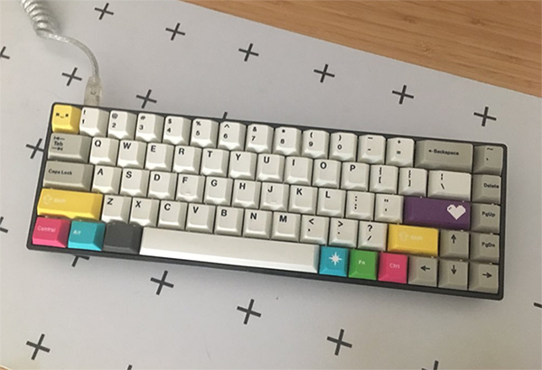

I feel like as a developer, we are constantly bombarded with *the next best thing*, all the time. Sometimes it feels that way for tooling as well. There is always something new out there, and consequently I feel like I am forever switching up my setup. However, I feel like lately I've been seriously enjoying what I've got going on, and I wanted to share.

## Dev Setup

- I use the amazing [Visual Studio Code](https://code.visualstudio.com/) as my code editor after a long stint with Atom. I was dubious at first but quickly fell in love. Things run so damn buttery smooth and the extensions are amazing.
- [Hyper](https://hyper.is/) is my CLI of choice after switching from iTerm 2. I use it with [Hyper Snazzy](https://github.com/sindresorhus/hyper-snazzy) theme and [Pure Prompt](https://github.com/sindresorhus/pure) (both from Sindre Sorhus). The result is gorgeously colorful and minimal.
- I use [Zsh](http://www.zsh.org/) as my shell with [Oh My Zsh](https://github.com/robbyrussell/oh-my-zsh) for the framework. This allows me to do cool stuff like [auto status](https://gist.github.com/oshybystyi/475ee7768efc03727f21) after every `git add` and [syntax highlighting](https://github.com/zsh-users/zsh-syntax-highlighting) for easier to read commands. The auto-complete features are top notch, as well.

Here's my [dotfiles](https://github.com/melanieseltzer/dotfiles) repo, if you want to deep dive into my configs.

## Apps

- As you can probably tell, I'm a little bit obsessed with emojis 😉 [Rocket](https://matthewpalmer.net/rocket/) makes it super easy to pop those suckers into every post and page.
- I use [Spectacle](https://www.spectacleapp.com/) for easy resizing of windows. This has seriously improved my speed while developing for different screen sizes. No more dragging the window around!
- I use [Kap](https://sindresorhus.com/kap) for all my screen recording, and [Gifski](https://sindresorhus.com/gifski) if I need to convert video to GIFs.

## Hardware

- My computer is a mid 2014 13" Macbook Pro.
- I have a [Dell Ultra HD 4k](https://www.amazon.com/gp/product/B00PC9HFO8/) for my external monitor, mounted with a [VIVO arm](https://www.amazon.com/gp/product/B00B21TLQU/) to my desk.
- I absolute adore mechanical keyboards. The board I use when working at home is a TADA 68 (which is now called Saber 68) with Mod-H switches (heavy! 😍) and CMYW modifiers for a colorful flare. The board I use at the office is a Leopold FC750 TKL with Cherry MX Browns and Coffee cap set (because ☕ is life).

I hope the above was useful! I'm [@melanieseltzer](http://twitter.com/melanieseltzer) if you want to show me what stuff you're rockin' 💪