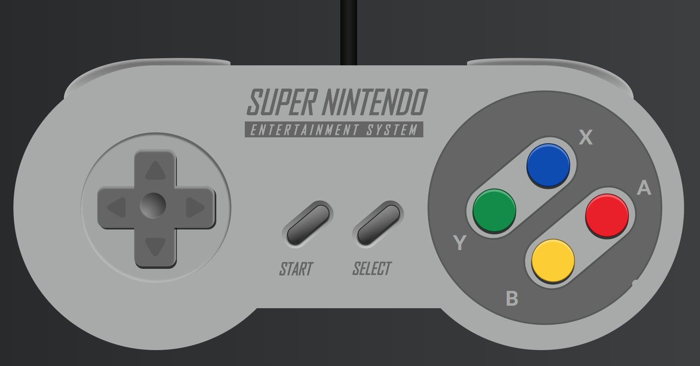

I really have no explanation for this one. I just wanted to flex my CSS muscles a bit 😉

<a href="https://melanieseltzer.github.io/css-snes-controller/" target="_blank">Live Site</a> &bull; <a href="https://github.com/melanieseltzer/css-snes-controller" target="_blank">Source Code</a>