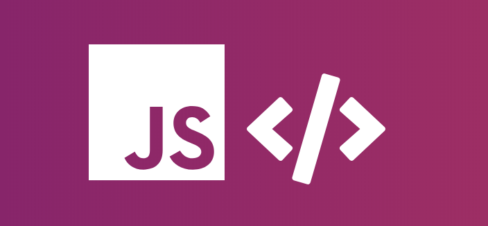

This cheatsheet is the result of me being easily overwhelmed while learning the ins and outs of ES6 😅 Turns out a lot of people have found it useful - it has over 170+ stars at the time of writing this.

<a href="https://melanieseltzer.github.io/es6-all-the-things/" target="_blank">Live Site</a> &bull; <a href="https://github.com/melanieseltzer/es6-all-the-things" target="_blank">Source Code</a>