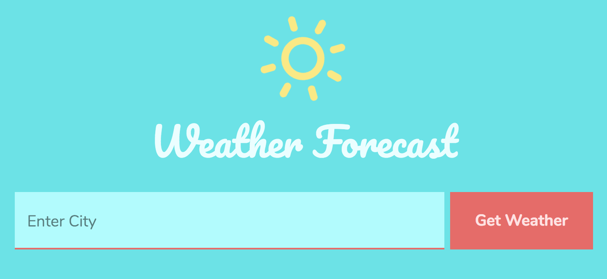

A simple weather forecast app built with React and Redux. Weather forecast is returned in 3 hour increments for the next 24 hours, in the timezone local to whichever city was searched. The results can be switched between Farenheit and Celcius on the fly.

<a href="https://weather-forecast-redux.herokuapp.com/" target="_blank">Live Site</a> &bull; <a href="https://github.com/melanieseltzer/weather-forecast" target="_blank">Source Code</a>