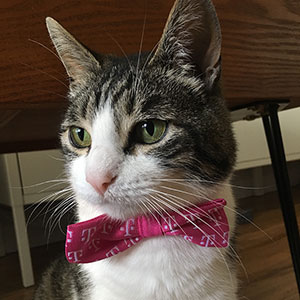

I'm an Aussie developer with 8 years professional industry experience. Although primarily Front End for most of my career, lately I've been dipping my toes in the world of Full Stack and have found I really enjoy it.

I moved to USA in 2010 and have been in Los Angeles ever since. I am currently a Front End developer at <a href="http://still-water.com" target="_blank">Still Water</a> in Santa Monica, CA.

The following is just some of my experience:

<section class="page__experience">
  

    <h3 class="experience__header">Languages</h3>
    <ul>
      <li>HTML</li>
      <li>CSS</li>
      <li>Javascript</li>
      <li>JQuery</li>
      <li>PHP</li>
      <li>Markdown</li>
    </ul>
  

  

    <h3 class="experience__header">Frameworks/libraries</h3>
    <ul>
      <li>React</li>
      <li>Redux</li>
      <li>Express</li>
      <li>GatsbyJS</li>
      <li>Middleman</li>
      <li>Bootstrap</li>
      <li>Bulma</li>
    </ul>
  

  

    <h3 class="experience__header">Templating/preprocessing</h3>
    <ul>
      <li>EJS</li>
      <li>Haml</li>
      <li>Pug</li>
      <li>Sass</li>
      <li>Stylus</li>
      <li>PostCSS/Autoprefixer</li>
    </ul>
  

  

    <h3 class="experience__header">Tooling</h3>
    <ul>
      <li>Git/Github</li>
      <li>Webpack</li>
      <li>Gulp</li>
      <li>Npm</li>
      <li>Eslint</li>
      <li>Prettier</li>
    </ul>
  

</section>

When I'm not coding, you can probably find me playing video games, hiking, traveling, or annoying my cat, *Callie* 👇😼

